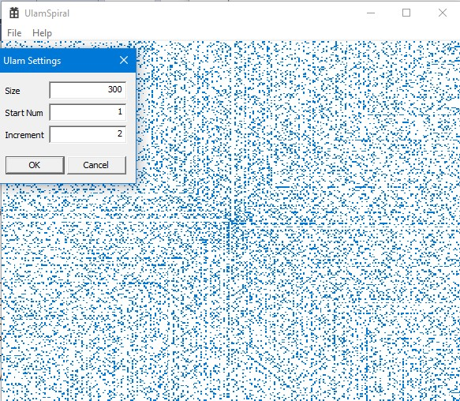

# Ulam Spiral

This program calculates variations on a Ulam Spiral, and displays them.  The picture
below should be self-explanatory if you know what the spiral is.  If not,
[Wikipedia is your friend](https://en.wikipedia.org/wiki/Ulam_spiral).

Here's an image:

## Techniques

This program is just a toy to further my Win32 knowledge.  I used:

 - the BufferedPaint APIs to avoid slowly displaying all the blocks
 
 - the MapMode APIs to render the blocks on a convenient coordinate space, 
   and have Windows map it to the full window rect

