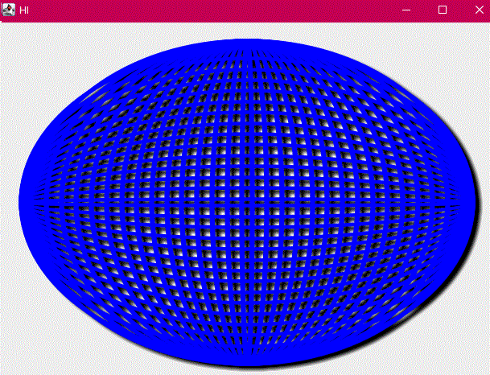

# Drop Shadow experiment

In preparation for a swing version of my Ultima V Runes tool (elsewhere on my github), I needed
to make sure I understood how I would produce a shadow underneath the runes.  In JavaFX, it's a
simple effect to add, but in Swing you have to roll it yourself.

This uses a convoution op with flat values, though for the real thing I could go Gaussian.

## Done in JSHELL

It's written in a funny way because I played with it in `jshell`... just run jshell on the script, and
then you can `/edit 10` to continually play with the graphics code and see the result in real-time in the
swing window. (Just resise the window slightly to force a repaint)

